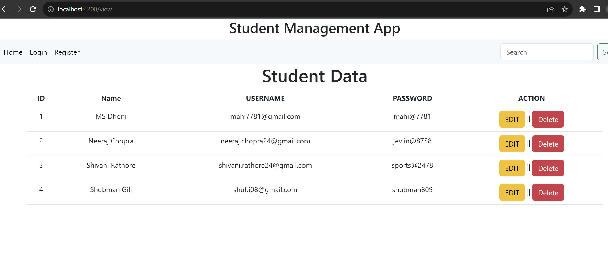

# Student Management Application

This project was generated with [Angular CLI](https://github.com/angular/angular-cli) version 16.0.5.

## Development server

Run `ng serve` for a dev server. Navigate to `http://localhost:4200/`. The application will automatically reload if you change any of the source files.

## Code scaffolding

Run `ng generate component component-name` to generate a new component. You can also use `ng generate directive|pipe|service|class|guard|interface|enum|module`.

## Output Screens:
1. Student Registration : To commence the student registration process, simply click on "Registration." This action will automatically redirect you to the Admin Login Page.

2. Admin Login : Administrators have the ability to access, modify, and remove student information within the system, providing them with comprehensive control over student records.

3. View Student Details

4. Edit Student Data

5. Delete Student Record

## Build

Run `ng build` to build the project. The build artifacts will be stored in the `dist/` directory.

## Running unit tests

Run `ng test` to execute the unit tests via [Karma](https://karma-runner.github.io).

## Running end-to-end tests

Run `ng e2e` to execute the end-to-end tests via a platform of your choice. To use this command, you need to first add a package that implements end-to-end testing capabilities.

## Further help

To get more help on the Angular CLI use `ng help` or go check out the [Angular CLI Overview and Command Reference](https://angular.io/cli) page.
